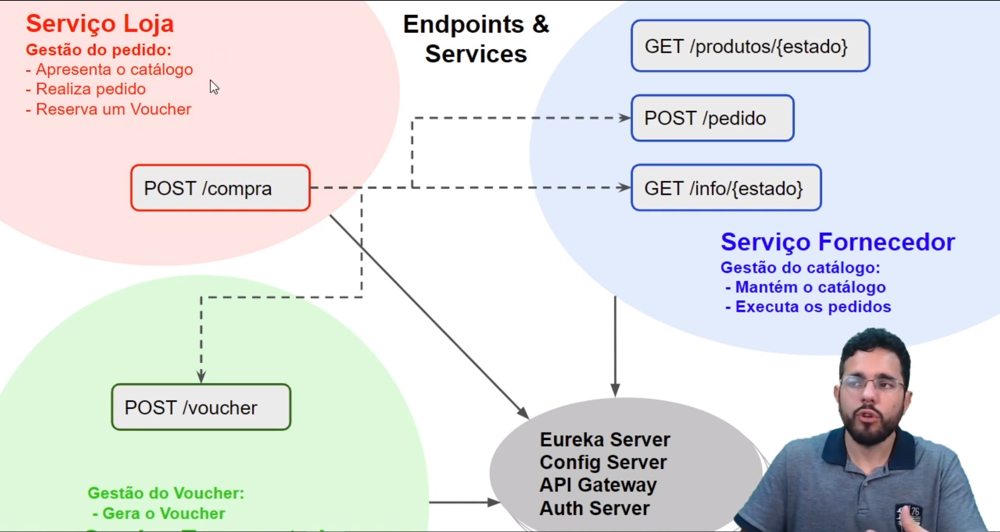

# Flower Store

This project is based on an Alura course on Microservices with Spring Cloud.

## Requirements to develop

- You must configure the config-server `application.yml` file with at least the `search-locations` property. You may change to the location of your own config repo on your local machine or use the commented configuration to use a github repository.
- A MariaDB instance running with the following schemas already created:
  - supplier
  - storefront
  - Note: you can configure the database, connection info and schema name on the configuration files on the config-server.

## Test Stuff

- There's a [cartRequests.jmx](README/cartRequests.jmx) to be imported on JMeter and test Hystrix.
- There's a [insomnia_requests.json](README/insomnia_requests.json) file to be imported on [Insomnia](https://insomnia.rest/download/) and test all endpoints.

## Components

### Store Front 

`storefront` folder. 

- The Store itself, like a website where a user buys flowers and stuff.
- Balances the requests to suppliers and carriers locally (client-side load-balancing) by fetching and caching Eureka server information (ribbon).
- Uses Hystrix to control timeout on methods that use other microservices.
- Uses Bulkhead (from Hystrix) to separate a group of threads for each operation managed by Hystrix.
- Controls the integration with other microservices.
  - RECEIVED: order created on the `storefront` microservice.
  - SUPPLIER_ORDER_CREATED: order incremented with information from the `supplier` microservice.
  - CARRIER_VOUCHER_CREATED: order incremented with information from the `carrier` microservice.

### Supplier 

`supplier` folder.

- Someone who provides products on different locations.
- Provides Orders to the `storefront` component.

### Carrier 

`carrier` folder.

- Someone who delivers stuff to clients from the suppliers.
- Provides Vouchers to the `storefront` component.

### API Gateway

`zuul-api-gateway` folder.

- Clients make requests for the API Gateway, which then redirects to the correct microservice for the request.
- Implemented with Netflix Zuul.
- Integrates (automatically) with Eureka to get microservices instances.
- Does client-side load balancing with Ribbon automatically.

### Eureka server 

`eureka-server` folder.

- Handles service registry and discovery.
- Every component registers itself here.
- Balancing is on the client, ~~via a RestTemplate bean configured to use Eureka server as a client~~ (this was replaced by the FeignClient. See older commits to understand how to configure a RestTemplate to work with Eureka Client).
- Balancing is on the client through FeignClient, which is auto-configured to balance requests when eureka client is being used.

### Config Server 

`config-server` folder.

- Provides configuration for the microservices.  The `config-repo` folder is used to store the configuration files.

### Other Stuff

- I've configured to log to papertrail (a log aggregator as a service) and used Spring Cloud Sleuth to add a traceId to every user request, being able to trace  the request across microservices.

## Running

- Run each of them separately using `./mvnw spring-boot:run` on each folder.

## Domain

## Endpoints and Services

